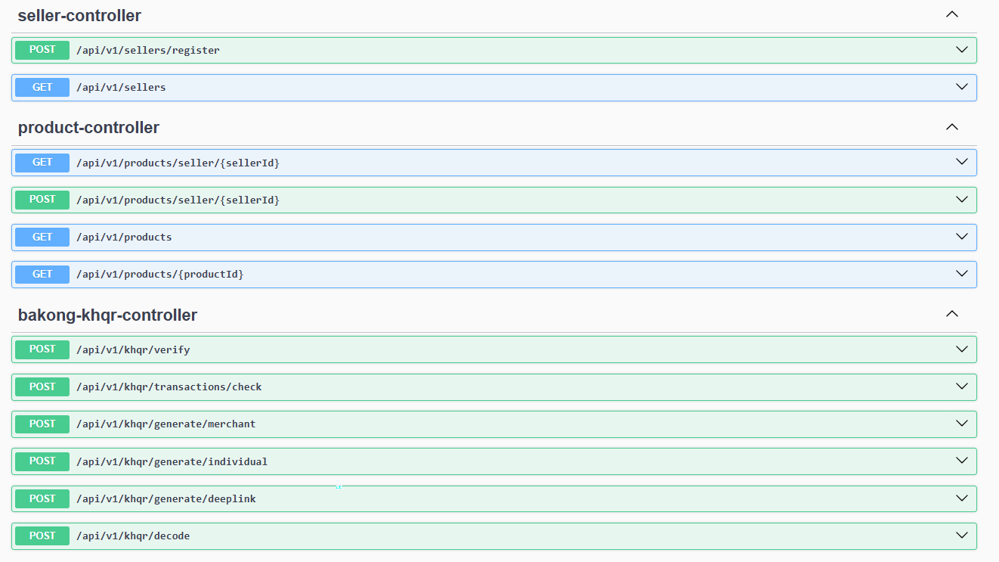
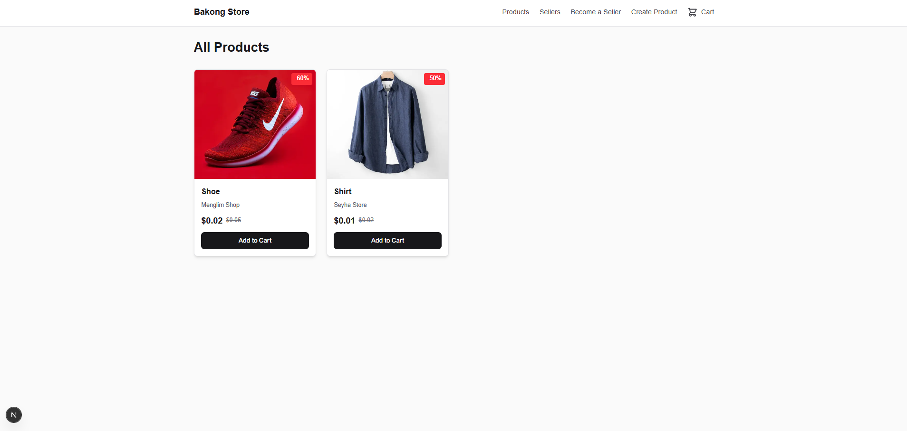
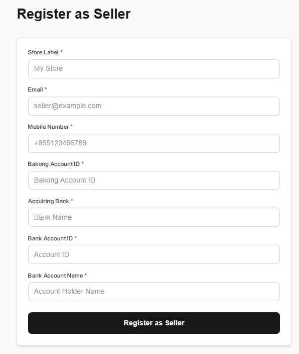
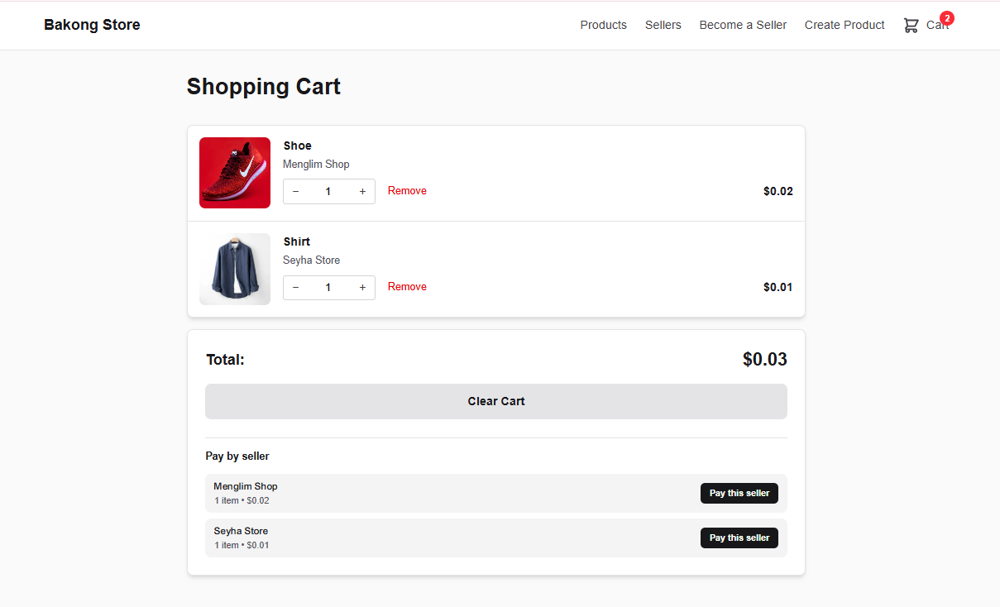
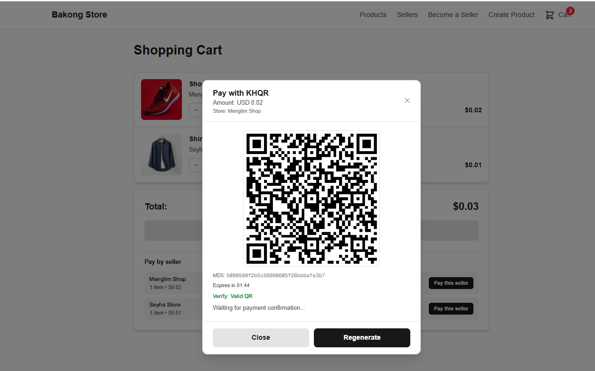

## Bakong KHQR Payment Integration Demo

Monorepo containing:

- **`bakong-api`**: Spring Boot (Java 21) backend exposing Bakong KHQR payment APIs (QR generation, verification, deep link, and transaction status check).
- **`bakong-ui`**: Next.js (App Router, TypeScript) frontend demonstrating seller/product flows and Bakong KHQR payment using the backend.

The main goal of this project is to **show how to integrate payments with Bakong using KHQR** end‑to‑end: from generating a payment QR on the server, to displaying it in the UI, to verifying the payment by checking the transaction with Bakong.

---

## Architecture Overview

- **Backend (`bakong-api`)**
  - Spring Boot 3.5, Java 21.
  - Uses official **Bakong KHQR Java SDK**: `kh.gov.nbc.bakong_khqr:sdk-java:1.0.0.16`.
  - Exposes REST endpoints under `http://localhost:8080/api/v1`.
  - Key Bakong endpoints:
    - `POST /api/v1/khqr/generate/merchant` – generate a merchant KHQR + MD5 hash.
    - `POST /api/v1/khqr/verify` – verify if a KHQR is valid.
    - `POST /api/v1/khqr/decode` – decode a KHQR into detailed data.
    - `POST /api/v1/khqr/generate/deeplink` – generate a Bakong deeplink URL for mobile apps.
    - `POST /api/v1/khqr/transactions/check` – check transaction status by MD5 via Bakong API.
  - Additional domain:
    - **Products** (`/api/v1/products`)
    - **Sellers** (`/api/v1/sellers`)

- **Frontend (`bakong-ui`)**
  - Next.js with the App Router (`app/` directory), TypeScript, React.
  - Talks to the backend via REST using `NEXT_PUBLIC_API_URL` (defaults to `http://localhost:8080/api/v1`).
  - Main flows:
    - Register a seller.
    - Create products for a seller.
    - Browse products and sellers.
    - Add products to cart and **pay via Bakong KHQR** (QR generation + transaction check).

---

## Prerequisites

- **Java & Backend**
  - Java 21
  - Gradle wrapper is included (`./bakong-api/gradlew`)
  - A running **PostgreSQL** instance (see `application.yml` for connection details).
  - Valid **Bakong credentials** (base URL and token).

- **Node & Frontend**
  - Node.js 18+ (recommended: latest LTS).
  - npm / yarn / pnpm / bun (any one).

---

## Backend (`bakong-api`) Setup

### 1. Configure Bakong & Database

Edit `bakong-api/src/main/resources/application.yml` to set:

- **Database**: JDBC URL, username, password for PostgreSQL.
- **Bakong API**:
  - `bakong.base-url` – Bakong API base URL.
  - `bakong.token` – Bearer token for Bakong.

Example (pseudo, adjust to your environment):

```yaml
bakong:
  base-url: https://api-bakong.nbc.gov.kh/v1
  token: YOUR_BAKONG_TOKEN
spring:
  datasource:
    url: jdbc:postgresql://localhost:5432/bakong
    username: bakong
    password: your_password
```

### 2. Run the Backend

From the project root:

```bash
cd bakong-api
./gradlew bootRun          # on Linux/macOS
gradlew.bat bootRun        # on Windows
```

By default, the API will be available at:

- `http://localhost:8080/api/v1`

You can explore endpoints using Swagger UI if enabled via Springdoc:

- `http://localhost:8080/swagger-ui.html` (or `/swagger-ui/index.html` depending on config).

---

## Frontend (`bakong-ui`) Setup

### 1. Install Dependencies

From the project root:

```bash
cd bakong-ui
npm install          # or yarn / pnpm / bun install
```

### 2. Configure API URL

Create `.env.local` in `bakong-ui`:

```env
NEXT_PUBLIC_API_URL=http://localhost:8080/api/v1
```

If not set, the app defaults to `http://localhost:8080/api/v1`.

### 3. Run the Frontend

```bash
cd bakong-ui
npm run dev
```

Open `http://localhost:3000` in your browser to access the UI.

---

## Bakong KHQR Payment Flow (High Level)

This section focuses on **how payment with Bakong is integrated end‑to‑end**.

### 1. Generate Merchant KHQR (Backend)

Endpoint:

- `POST /api/v1/khqr/generate/merchant`

Controller:

- `BakongKHQRController.generateMerchant(...)` in `bakong-api` calls:
  - `BakongKHQRServiceImpl.generateMerchant(...)`
  - Uses `BakongKHQR.generateMerchant(MerchantInfo)` from the Bakong SDK.

Request payload (`MerchantInfoRequest`):

- `bakongAccountId`, `merchantId`, `acquiringBank`
- `currency` (e.g. `"USD"` or `"KHR"`)
- `amount`
- `merchantName`, `merchantCity`
- Optional: `expirationTimestamp`

Response shape:

- `{ "success": true, "qr": "<KHQR string>", "md5": "<md5 hash>" }`

The **`qr`** is the KHQR string encoded in the QR code, and **`md5`** is used later to check the transaction status.

### 2. Display KHQR in the UI

On the frontend, the key helper lives in `bakong-ui/lib/khqr.ts`:

- `generateMerchantKhqr(request: GenerateMerchantKhqrRequest)`
  - Sends a `POST` to `/khqr/generate/merchant`.
  - Returns either:
    - `{ success: true; qr: string; md5: string }`
    - `{ success: false; error: string }`

The UI:

- Calls `generateMerchantKhqr` when the user chooses to pay.
- Displays the returned `qr` as a scannable QR code (often via a QR code component or library).
- Stores the `md5` value for later transaction checking.

### 3. Customer Pays with Bakong App

Steps:

- The customer scans the KHQR with the **Bakong mobile app** or another supported banking app.
- Confirms the payment in their app.
- Bakong processes the transaction and associates it with the **`md5`** hash that was generated with the KHQR.

### 4. Verify / Decode KHQR (Optional)

If you need to verify or inspect the KHQR:

- `POST /api/v1/khqr/verify`
  - Request: `{ "qrCode": "<KHQR string>" }`
  - Response: `{ "success": true, "valid": boolean }`

- `POST /api/v1/khqr/decode`
  - Request: `{ "qrCode": "<KHQR string>" }`
  - Response: `{ "success": true, "data": { ...decoded fields... } }`

These are implemented in:

- `BakongKHQRController.verify(...)`
- `BakongKHQRController.decode(...)`
- Backed by `BakongKHQRServiceImpl.verify(...)` and `decode(...)` using the Bakong SDK methods.

### 5. Check Transaction Status by MD5 (Backend)

Endpoint:

- `POST /api/v1/khqr/transactions/check`

Controller:

- `BakongKHQRController.checkTransactionByMd5(...)`
  - Accepts `CheckTransactionRequest` with field `md5`.
  - Delegates to `BakongKHQRServiceImpl.checkTransactionByMd5(md5)`.

Service implementation:

- Builds a POST request to `${bakong.base-url}/check_transaction_by_md5`.
- Adds `Authorization: Bearer <bakong.token>` header.
- Sends `{ "md5": "<md5 hash>" }` in the body via `RestTemplate`.
- Returns `CheckTransactionResponse` containing:
  - `responseCode`, `responseMessage`, `errorCode`
  - `data` with transaction details: `fromAccountId`, `toAccountId`, `currency`, `amount`, timestamps, etc.

This is the critical step to **confirm that a payment was completed** in Bakong.

### 6. Poll / Confirm Payment in the UI

On the frontend, you can confirm the payment with:

- `checkTransactionByMd5(request: BakongCheckTransactionRequest)` in `bakong-ui/lib/khqr.ts`
  - Sends `POST /khqr/transactions/check` with `{ md5 }`.
  - Returns `BakongCheckTransactionResponse` mirroring the backend response.

Typical UI pattern:

1. Call `generateMerchantKhqr` to get `qr` + `md5`.
2. Show the QR code to the user.
3. Start polling `checkTransactionByMd5` every few seconds with the same `md5`.
4. When `responseCode` indicates success and `data` is not null, treat the order as **paid** and update UI (e.g., show success state, save order, clear cart).

---

## Product & Seller Flows (How They Tie into Payments)

The backend exposes:

- `GET /api/v1/products` – list products.
- `GET /api/v1/products/{id}` – product details.
- `GET /api/v1/products/seller/{sellerId}` – products by seller.
- `POST /api/v1/products/seller/{sellerId}` – create product.
- `GET /api/v1/sellers` – list sellers.
- `POST /api/v1/sellers/register` – register a new seller.

The frontend wraps these in `bakong-ui/lib/api.ts`:

- `getAllProducts()`, `getProductById(id)`, `getProductsBySeller(sellerId)`
- `getAllSellers()`
- `registerSeller(request)`
- `createProduct(sellerId, request)`

Pages under `bakong-ui/app/`:

- `page.tsx` – main landing / product listing.
- `products/[id]/page.tsx` – product detail with “Add to cart” / “Pay” flows.
- `cart/page.tsx` – cart summary and checkout.
- `register-seller/page.tsx` – seller registration.
- `create-product/page.tsx` – create product for a seller.
- `sellers/page.tsx` and `products/seller/[sellerId]/page.tsx` – seller and seller‑specific products.

The **cart + payment** pages use:

- `CartContext` for cart state.
- Components such as `PayKhqrModal` to handle Bakong KHQR payment interactions (QR display + status polling via the KHQR APIs).

---

## Running Everything Together (Local)

1. **Start PostgreSQL** and create the database configured in `application.yml`.
2. **Configure Bakong settings** in `bakong-api/src/main/resources/application.yml`.
3. **Start backend**:
   - `cd bakong-api && ./gradlew bootRun` (or `gradlew.bat bootRun` on Windows).
4. **Start frontend**:
   - `cd bakong-ui && npm install && npm run dev`.
5. Open **`http://localhost:3000`**:
   - Register a seller.
   - Create a product.
   - Add product to cart and pay using **Bakong KHQR**.

---

## Screenshots (API & UI)

These screenshots illustrate the end‑to‑end Bakong KHQR payment flow in this demo.

### API endpoints (Swagger UI)

The backend exposes all seller, product, and Bakong KHQR endpoints via Swagger:



### Product listing page

The main store page shows all products, including pricing and discount labels:



### Register as Seller form

Sellers can register by providing store, contact, and Bakong account information:



### Shopping cart with per-seller payment

The cart groups items by seller and allows paying each seller separately:



### KHQR payment modal

When the user chooses to pay, the app generates a KHQR, shows the MD5, expiry, and verification status, and waits for Bakong payment confirmation:



